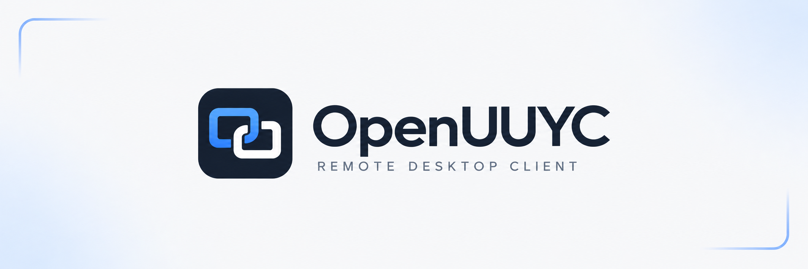

# OpenUUYC



OpenUUYC 是用 Rust 编写的 UU 远程第三方客户端，支持 Windows 和 Linux。使用已有的 UU 账号登录，连接和控制远端设备。

项目目前处于快速迭代阶段，当前优先完善 Windows 端功能。**Windows 平台正式版开发完成后，我们会推进 Linux 等其他平台的适配。**

现阶段代码结构、内部接口和平台适配边界仍会调整。如果计划提前移植到其他平台，建议先通过 [Issue](https://github.com/djkcyl/openuuyc/issues) 沟通适配范围，以明确的版本或提交为起点，并预留跟进主线变动的时间。屏幕采集、图形呈现、输入和系统服务等能力需要针对目标平台实现与验证。

## 下载与使用

从 [Releases](https://github.com/djkcyl/openuuyc/releases) 下载 Windows x64 客户端，双击运行，扫码或短信登录后选择设备连接。主控端支持连接 UU 官方客户端；本机被控功能见下文。

最新稳定版为 [v0.7.0](https://github.com/djkcyl/openuuyc/releases/tag/v0.7.0)。[v1.0.0-alpha.5 预发布](https://github.com/djkcyl/openuuyc/releases/tag/v1.0.0-alpha.5)提供正在开发的本机被控能力。

## 能力表

以下为当前预发布版本在 **Windows x64** 上的能力；Linux x64 需自行构建，差异见[下文](#linux-版差异)。主控端指使用 OpenUUYC 连接远端设备，被控端指其他设备连接运行 OpenUUYC 的本机；具体功能还取决于对端能力和授权。

| 功能 | 主控端 | 被控端 | 说明 |
| --- | --- | --- | --- |
| 同账号远程连接 | 支持 | 支持 | 本机在连接设置中开启“允许被控” |
| 设备 ID / 验证码协助 | 支持主动连接 | 待实现 | 主控端支持最近连接、收藏和保存验证码 |
| 画面传输 | 接收与播放 | 采集与编码 | H.264 / H.265，支持画质、码率和帧率调整 |
| 硬件编解码 | DXVA11 解码 | NVENC / AMF / QSV 编码 | 按显卡与驱动能力选择 |
| 软件编解码 | Rust H.264 解码 | Rust H.264 编码 | 软件路径仅支持 H.264 |
| 真彩与 HDR | 接收与呈现 | 采集与编码 | 按双端能力协商；HDR 需系统及硬件支持 |
| 键盘与鼠标 | 支持 | 支持 | 相对/绝对鼠标、组合键、光标样式与大小同步 |
| 移动端原生触摸 | — | 支持接收 | 可接收移动端官方客户端的触摸输入 |
| 多显示器 | 切屏、多窗口观看 | 多屏采集与独立视频轨道 | 支持屏幕标签拖出窗口 |
| 分辨率与 DPI | 支持调整远端 | 支持接收调整 | 按目标屏幕支持的配置应用 |
| 虚拟屏与超级屏 | 支持操作远端 | 支持创建、删除与恢复 | OpenUUYC 被控端需安装虚拟显示驱动 |
| 桌面声音 | 支持播放 | 采集与发送 | 支持跟随系统默认或指定播放设备，设备变化后自动恢复采集 |
| 麦克风 / 虚拟麦克风 | 支持选择设备并发送 | 支持接收 | 本机接收需安装可选虚拟音频驱动，供录音、语音等应用使用 |
| 音质设置 | 麦克风发送可调 | 桌面声音发送可调 | 64 / 128 / 192 / 256 kbps Opus，默认 128 kbps，连接中可切换 |
| 虚拟扬声器与麦克风 | 无需本地虚拟声卡 | 支持 | 驱动安装在被控端；默认音频设备可选保持原有、仅调整麦克风、仅调整扬声器或都调整 |
| 剪贴板同步 | 支持 | 待实现 | 主控端支持文字、富文本、图片及文件/文件夹复制粘贴 |
| 独立文件传输 | 支持 | 待实现 | 目录浏览、双向传输、冲突处理、暂停续传及后台任务 |
| TCP 端口转发 | 支持 | 待实现 | 自定义监听地址、连通性检查及流量统计 |
| 批注与指示工具 | 支持发送 | 待实现 | 画笔、形状、撤销重做、激光笔和鼠标指示 |
| 远程电源操作 | 支持 | 待实现 | 主控端按远端能力提供开机、关机和重启 |
| 锁屏 / PIN 页面控制 | 支持连接官方被控端 | 安装服务后支持 | OpenUUYC 被控端通过系统服务采集和处理输入 |

客户端另提供设备列表与详情、别名管理、自定义快捷键、本机编解码诊断、性能监控，以及[插件和节点图](plugins/README.md)。

主页“安装服务”将程序安装到 `Program Files\OpenUUYC`，统一安装后台服务、自有输入驱动和 OpenUUYC 虚拟显示驱动，并创建桌面和开始菜单快捷方式。驱动共用 OpenUUYC 签名证书，安装需确认机器证书信任及管理员授权。安装完成后自动打开安装目录中的程序，之后不再依赖下载文件。登录自动启动托盘，关闭窗口隐藏到托盘，托盘“退出”停止本次运行。运行中打开新版安装包，确认更新后会自动关闭旧版并打开新版。

虚拟声卡在“连接设置 → 服务管理”中按需安装。更新程序时会检查已安装的驱动，需要更新的组件随服务更新；未安装的虚拟声卡不会自动安装。服务卸载和完整程序卸载均可分别选择是否移除虚拟显示驱动、虚拟声卡；完整卸载还可选择删除本机登录信息、设置、插件、缓存和日志，默认保留数据。

### 虚拟音频驱动的使用条件

**当前虚拟音频驱动使用测试签名，尚未取得 Microsoft 正式签名。** 此要求仅针对自有虚拟声卡；普通远程画面、键鼠和桌面声音采集不需要关闭驱动签名强制。

使用虚拟扬声器或在 OpenUUYC 被控端接收远程麦克风前，需要手动准备允许测试驱动的 Windows 启动环境，再在程序中安装虚拟声卡：

- 临时测试：按住 Shift 点击“重启”，进入“疑难解答 → 高级选项 → 启动设置 → 重启”，按 **7 / F7** 选择“禁用驱动程序强制签名”。该选择只作用于本次启动；下次正常重启后驱动可能无法加载。参见 [Windows 启动设置](https://support.microsoft.com/en-us/windows/experience/startup-boot/windows-startup-settings)。
- 持续测试：以管理员身份执行 `bcdedit /set testsigning on` 后重启；测试结束执行 `bcdedit /set testsigning off` 并重启恢复。Secure Boot、BitLocker 和组织策略可能限制此设置，具体要求见 [Microsoft 测试签名说明](https://learn.microsoft.com/en-us/windows-hardware/drivers/install/the-testsigning-boot-configuration-option)。

这些启动选项会降低驱动加载保护，请仅在了解影响的测试环境中使用。程序不会自动修改安全启动、签名策略或重启电脑；安装证书本身不等于 Windows 已允许加载内核驱动。

1.0.0 正式版将在 Windows 平台完整被控功能完成并验证后发布。

### Linux 版差异

Linux 版可以登录、管理设备、观看和控制远端桌面，界面走 wgpu（Vulkan，缺失时回退 OpenGL），X11 与 Wayland 均可运行。本机被控在 Xorg 会话中可用。与 Windows 版相比：

- **解码**：H.264 通过 VA-API 硬件解码（Constrained Baseline、Main、High，8 位 4:2:0），其余 H.264 格式使用 Rust 软件解码；H.265 暂不支持。硬件解码需要对应的 VA-API 驱动。
- **剪贴板**：文字、图片与文件双向同步。粘贴远端复制的文件时，文件通过挂载在 `$XDG_RUNTIME_DIR` 下的只读 FUSE 文件系统按需读取，需要安装 `fuse3`。
- **本机被控**：在已登录的桌面内运行。画面采集按 Sunshine 的优先级选择：Xorg 下先用 NVIDIA NvFBC（画面直接抓进显存交给 NVENC，仅在 NVENC 可用时选用），再到 X11 MIT-SHM，最后是 XDG 屏幕共享门户（PipeWire）；Wayland 下只用门户。门户第一次使用时需要在本机屏幕上点“共享”，授权会被记住（`~/.local/share/OpenUUYC/screencast-restore-token`，在系统隐私设置中可撤销）；可用环境变量 `OPENUUYC_CAPTURE`（如 `nvfbc`、`x11,portal`）指定顺序。编码优先用 NVENC（H.264/H.265，4:2:0 与 4:4:4，8 位），不可用时回退 Rust H.264 软件编码；键鼠经 XTest 注入（按物理键位映射，文字输入不依赖键盘布局，移动端触摸按单指指针模拟），因此键鼠目前只在 Xorg 会话可用；支持物理多屏与通过 RandR 切换分辨率，退出时恢复。暂无 AMD/Intel 硬件编码、10 位与 HDR、KMS 采集、虚拟屏、超级屏、按显示器 DPI、桌面声音与远端麦克风（OpenUUYC Audio 虚拟声卡是 Windows 驱动；Linux 上开启时会提示暂不支持），也没有后台服务，因此无法在登录界面或锁屏时被控。
- **安装与托盘**：没有“安装服务”，直接运行构建出的程序。关闭窗口隐藏到托盘（StatusNotifierItem；GNOME 需 AppIndicator 扩展，Ubuntu 默认启用），桌面没有托盘时关闭即退出。
- **未接入**：批注与白板、插件节点图、多显示器独立窗口、HDR、全局快捷键（快捷键仅在播放窗口获得焦点时生效），以及诊断页中的解码检查。
- **凭据**：登录态保存在系统密钥环（Secret Service），需要运行 gnome-keyring、KWallet 等服务；没有明文回退。

Wayland 下窗口的拖动与缩放由合成器接管，因此不支持窗口吸附等 Windows 专有行为。

## 构建

### Windows

需要 Rust stable（MSVC）、Visual Studio C++ 构建工具、Windows SDK、CMake 和 UPX。软件 H.264 编解码使用项目 Rust 核心。

```powershell
git clone https://github.com/djkcyl/openuuyc.git
cd openuuyc
cargo dist
```

程序位于 `target/dist/`，默认使用 UPX 压缩，并检查压缩完整性和实际启动；任一步失败都会中止打包，不以未压缩文件替代发布。需要未加壳的开发构建时运行 `cargo dist --no-upx`，产物位于 `target/dist/uncompressed/`。命令行用法可通过程序的 `--help` 查看。

命令行支持 `gui`（默认）、`login`、`devices`、`connect` 和 `uninstall`。`devices` 会列出设备 ID；连接时使用完整设备名或 `connect --device-id <ID>`，二者选一。`gui --background` 启动到托盘；观看的帧率、编码、硬件解码和链路选项见对应命令的 `--help`。`--log-level`、`--log-file` 可用于指定诊断日志。

源码已包含签名驱动包和公钥证书，构建主程序不需要签名私钥。修改驱动及发布前验证见 [驱动构建说明](drivers/README.md)。

### Linux

需要 Rust stable（edition 2024）与 C/C++ 工具链。Ubuntu 22.04 及以上：

```bash
sudo apt install build-essential cmake clang pkg-config libva-dev \
    libasound2-dev libdbus-1-dev libxkbcommon-dev libxkbcommon-x11-dev \
    libwayland-dev libx11-dev libxcb1-dev libxrandr-dev libxi-dev libxcursor-dev \
    libgl1-mesa-dev libvulkan-dev libudev-dev libssl-dev fonts-noto-cjk fuse3
git clone https://github.com/djkcyl/openuuyc.git
cd openuuyc
cargo build --release
./target/release/OpenUUYC gui
```

`cargo dist` 只用于 Windows 打包，Linux 直接用 `cargo build`。

## 反馈与许可

问题和建议请提交到 [Issues](https://github.com/djkcyl/openuuyc/issues)。报告问题时附上版本、操作步骤和相关日志，注意去掉账号、验证码等私人信息。

OpenUUYC 非网易官方项目。源码公开，但项目整体未采用开源许可证，使用与分发条件见 [LICENSE](LICENSE)。第三方及派生代码保留各自的许可，详见 [THIRD_PARTY_NOTICES](THIRD_PARTY_NOTICES)。
