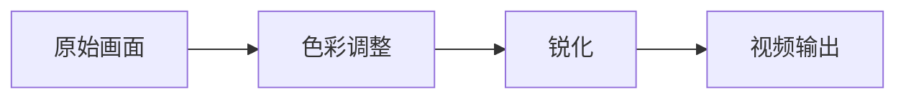

# 画面滤镜示例

这个示例演示一个 DLL 提供多个 GPU 视频节点。三个节点都保持源画面尺寸，按当前帧处理，不等待下一帧；Shader 本身仍有执行开销。

## 节点和参数

| 节点 | 参数 | 默认值 | 范围 |
| --- | --- | --- | --- |
| 色彩调整 | 亮度 `brightness` | 0 | -1～1 |
| 色彩调整 | 对比度 `contrast` | 1 | 0～3 |
| 色彩调整 | 饱和度 `saturation` | 1 | 0～3 |
| 锐化 | 强度 `amount` | 0.3 | 0～2 |
| 像素化 | 像素块大小 `block_size` | 8 | 1～64，整数 |

色彩调整的默认值保持原图；饱和度为 0 时输出灰度画面。锐化强度为 0、像素块大小为 1 时，对应节点保持原图。

三个节点的输入和输出都是 `frame`，端口 ID 均为 `frames`。类型 ID 分别是 `openuuyc.effects.color`、`openuuyc.effects.sharpen`、`openuuyc.effects.pixelate`。

## 构建与安装

以下命令从仓库根目录执行。需要 Windows x64、Rust MSVC 工具链和 Windows SDK；构建脚本自动寻找 `fxc.exe`，也可以用环境变量 `FXC` 指定其完整路径。

```powershell
cargo build --release --locked --bin OpenUUYC
cargo build --release --locked --manifest-path plugins/effects/Cargo.toml
New-Item -ItemType Directory -Force target/release/plugins/effects | Out-Null
Copy-Item plugins/effects/target/release/openuuyc_effects.dll target/release/plugins/effects/
```

安装只需 `openuuyc_effects.dll`。HLSL 编译结果和插件清单均已内嵌，不需要复制 `manifest.json`、HLSL 或独立 Shader 文件。

## 使用示例图



可以手动连接，也可以安装仓库提供的示例图：

```powershell
$graphDirectory = Join-Path $env:LOCALAPPDATA 'OpenUUYC/graphs'
New-Item -ItemType Directory -Force $graphDirectory | Out-Null
Copy-Item plugins/examples/filters.graph.json (Join-Path $graphDirectory '6aef660d-c986-451d-8dc3-104b024d68ef.graph.json')
```

在节点图页面刷新列表，从“文件”菜单打开“画面滤镜示例”，点击“应用”。随后在观看窗口的插件菜单选择并启用该图。

示例图将饱和度设为 0，便于直接观察灰度效果；改回 1 可恢复彩色。像素化节点可以从节点库拖入后串接。

## 源码结构

- `manifest.json`：插件身份、三个节点的端口、参数和用途说明。
- `build.rs`：将 HLSL 编译为 `ps_5_0` 字节码。
- `src/lib.rs`：按节点 ID 返回 `VideoApi`，检查参数并生成 `VideoProgram`。
- `src/*.hlsl`：各滤镜的像素处理实现。

新增滤镜时，补充节点声明、Shader 编译项和查询分支即可。接口细节见 [SDK 文档](../sdk/README.md)。
